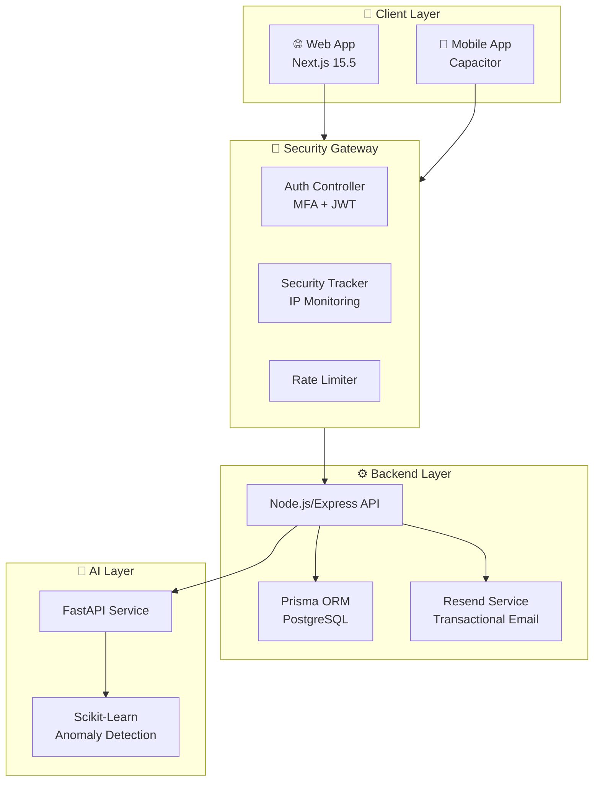
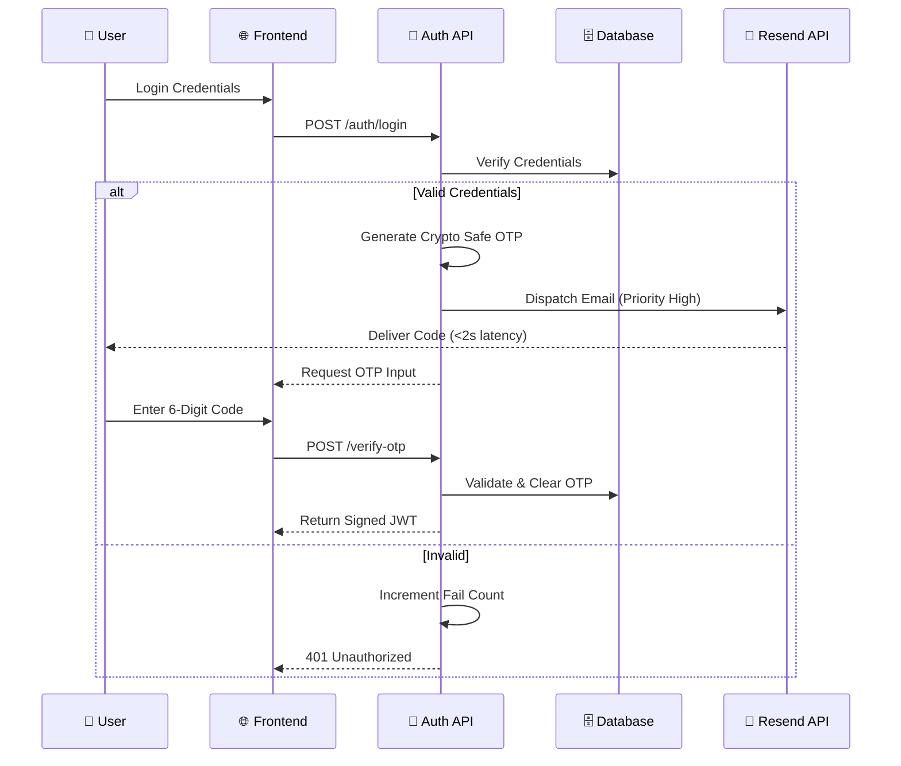
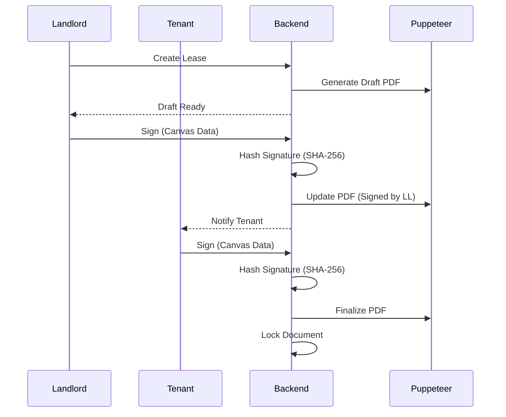

<div align="center">
  <sub>📋 <i>Technical Documentation for Mobile SecOps Challenge 2025</i></sub>
</div>
<br>
<div align="center">
  <table>
    <tr>
      <td align="center" width="200">
        <b>UiTM Tapah</b>
      </td>
      <td align="center" width="200">
        <i>Build Fast,<br>Defend Smarter</i>
      </td>
      <td align="center" width="200">
        <b>Team 8</b>
      </td>
    </tr>
  </table>
</div>

<h1 align="center">🏠 RentVerse (Secured by Team 8)</h1>
<p align="center"><i>A Secure Property Rental Platform with DevSecOps Integration</i></p>

---

## 📋 Challenge Submission Details

| Field | Details |
|-------|---------|
| **Challenge** | Mobile SecOps 21 Days Challenge |
| **Organizer** | Metairflow R&D Sdn. Bhd. |
| **Team Name** | **Team 8** |
| **Institution** | UiTM Cawangan Perak, Kampus Tapah |
| **Submission Date** | 17 December 2025 |

---

## 👥 Team Members

<div align="center">
  <table>
    <tr>
      <td align="center" width="250">
        <b>MUHAMMAD AFIQ DANIAL BIN MOHD DAUDA</b><br>
        <code>2024977917</code>
      </td>
      <td align="center" width="250">
        <b>MUHAMMAD ANIQ IZZUDDIN BIN MOHAMAD SALLEH</b><br>
        <code>2024741135</code>
      </td>
      <td align="center" width="250">
        <b>ALIMI BIN RUZI</b><br>
        <code>2024568765</code>
      </td>
    </tr>
  </table>
</div>

---

## 📚 Table of Contents

| Section | Description |
|---------|-------------|
| [📈 System Architecture](#-system-architecture) | High-level overview & flow diagrams |
| [🛡️ Core Development Modules](#️-core-development-modules-module-1-5) | Detailed breakdown of M1-M5 |
| [🚀 Feature Innovation](#-feature-innovation-bonus-pool) | AI Threat Intel & Zero Trust |
| [✨ Special Features](#-special-features) | Digital Agreements & Resend API |
| [🛠️ Technology Stack](#️-technology-stack) | Frontend, Backend, AI, & DevOps |
| [⚖️ Legal & IP](#️-intellectual-property--ownership) | Ownership & Compliance |

---

## 📈 System Architecture

### 🏗️ High-Level System Overview

Our architecture separates concerns between the Client (Mobile/Web), the Security Gateway, and the Intelligence Layer (AI).



### 🔐 Authentication Flow (Zero-Friction MFA)We solved the common "SMTP Timeout" issue by integrating Resend API, ensuring OTPs are delivered in <2 seconds.



---

## 🛡️ Core Development Modules (Module 1-5) 
### 🟢 Module 1: Secure Login & MFA 
🔐**Description:** A robust authentication system designed to withstand brute-force attacks while maintaining user experience.

**Security Focus:** Authentication & Authorization (OWASP M1–M3)

**Implementation Details:**

* **🔐 Multi-Factor Authentication (MFA):**
* **OTP Generation:** We use `crypto.randomBytes()` to generate non-predictable 6-digit codes.
* **Delivery System:** Integrated **Resend API** to bypass network SMTP blocks.
* **Security:** OTPs are hashed using `bcrypt` before storage and expire strictly after 5 minutes.
* **Rate Limiting:** Limits OTP verification attempts to 5 per 15 minutes.


* **👤 Role-Based Access Control (RBAC):**
* **Roles:** `USER` (Tenant), `LANDLORD` (Property Owner), `ADMIN` (System Admin).
* **Middleware:** `authorize()` middleware validates JWT payload roles before granting access to protected routes.


### 🔵 Module 2: Secure API Gateway 
🔒**Description:** Centralized gateway enforcing HTTPS, stateless authentication, and input validation.

**Security Focus:** Secure Communication (OWASP M5–M6)

**Implementation Details:**

* **🔒 JWT Authentication strategy:**
* **Stateless:** No session storage on server; scalable.
* **Token Blacklist:** Implemented a Redis-like in-memory blacklist for immediate logout.
* **Strict Expiry:** Access tokens expire in 15 minutes; Refresh tokens in 7 days.


* **🛡️ Security Headers:**
* We implemented **Helmet.js** to enforce:
* `Content-Security-Policy`: Prevents XSS.
* `X-Frame-Options`: Prevents Clickjacking.
* `Strict-Transport-Security`: Enforces HTTPS.


### 🟣 Module 3: Digital Agreement 
📝**Description:** A legally binding digital lease workflow with non-repudiation features.

**Security Focus:** Data Integrity & Workflow Validation

**Workflow Diagram:**



**Key Features:**

* **Tamper Detection:** Signatures are hashed (SHA-256) with timestamps.
* **Audit Trail:** IP address and User Agent are logged for every signature event.
* **Storage:** Signed PDFs are stored securely on Cloudinary.

### 🟠 Module 4: Smart Notification & Alert System 
🔔**Description:** A custom-built security tracker that monitors real-time threats and notifies admins.

**Security Focus:** DevSecOps Monitoring & Incident Detection

**🔧 How It Works (Custom Implementation):**
We built a sophisticated tracking engine (`securityTracker.js`) that monitors failed login attempts.

1. **IP-Based Tracking:** Monitors each IP address independently in real-time.
2. **Intelligent Thresholds:**
* **10 Failed Attempts:** Triggers **HIGH** severity alert.
* **20 Failed Attempts:** Triggers **CRITICAL** severity alert & IP Ban.


3. **Anti-Spam Mechanism:** Implements a 30-minute cooldown to prevent admin alert fatigue.

**📧 Alert Example:**

> **Subject:** ⚠️ Security Alert: 10 Failed Login Attempts from 192.168.1.100
> **Body:** "Suspicious activity detected. Target Account: admin@rentverse.com. Recommended Action: Review Audit Logs."

### 🔴 Module 5: Activity Log Dashboard 
📊**Description:** Admin-facing dashboard for visualizing threats and system health.

**Security Focus:** Threat Visualization & Accountability

**Dashboard Features:**

* **Real-Time Metrics:** Total Logins vs. Failed Logins (24h).
* **Risk Visualization:** Users with Risk Score > 50 are highlighted in red.
* **Geographic Data:** Map showing origin of login attempts.
* **Audit Logs:** Downloadable CSV of all security events.

---

## 🚀 Feature Innovation (Bonus Pool) 
### 🟡 Threat Intelligence System (AI-Powered)We integrated a Python Microservice using **FastAPI** and **Scikit-learn**.

* **Model:** Isolation Forest (Anomaly Detection).
* **Input:** Login Time, Geo-Location, Device Fingerprint.
* **Output:** Anomaly Score (0.0 to 1.0). If Score > 0.8, the login is flagged for manual review.

### 🟪 Zero-Trust Access Logic* **Device Fingerprinting:** We generate a unique hash for every device.
* **New Device Policy:** If a user logs in from a new device hash, they must complete MFA, even if they usually use password-only.

### 🟩 Automated Security TestingWe integrated GitHub Actions to run security scans on every push.

* **SAST:** ESLint security plugin.
* **Dependency Scan:** `npm audit` (Backend) & safety check (Python).
* **Secret Detection:** Gitleaks to prevent API key leakage.

---

## 🛠️ Technology StackOur stack is chosen for performance, type safety, and rapid development.

### 🎨 Frontend (Web & Mobile)| Technology | Version | Purpose |
| --- | --- | --- |
| **Next.js** | 15.5 | React Framework with Turbopack |
| **Tailwind CSS** | 4.0 | Utility-first styling |
| **Zustand** | 5.0 | State Management |
| **MapTiler** | 3.8 | Interactive Maps |
| **Capacitor** | 8.0 | Native Mobile Runtime |

### ⚙️ Backend & Security| Technology | Version | Purpose |
| --- | --- | --- |
| **Node.js** | 20+ | Server Runtime |
| **Express.js** | 4.18 | API Framework |
| **Prisma** | 5.3 | Type-safe ORM |
| **Resend API** | - | Transactional Email Service |
| **Helmet.js** | 7.0 | Security Headers |

### 🧠 AI & Data Science| Technology | Version | Purpose |
| --- | --- | --- |
| **FastAPI** | 0.116 | High-performance Python API |
| **Scikit-learn** | 1.7 | Anomaly Detection Models |
| **Pandas** | 2.3 | Data Manipulation |
| **Uvicorn** | 0.35 | ASGI Server |

---

## ⚖️ Intellectual Property & Ownership**Proprietary Rights:**

In compliance with the project engagement agreement, all deliverables, including source code, algorithms, designs, and documentation ("Work Product") produced within this repository are the exclusive property of **Metairflow R&D Sdn. Bhd.**

**Usage Restrictions:**

This repository is submitted as part of the Mobile SecOps 21 Days Challenge. Unauthorized reproduction or commercial use is strictly prohibited for 24 months.

<div align="center">


<p><i>Built with ❤️ by Team 8 for Mobile SecOps Challenge 2025</i></p>
<p>© 2025 RentVerse. All rights reserved.</p>
</div>

```

```
